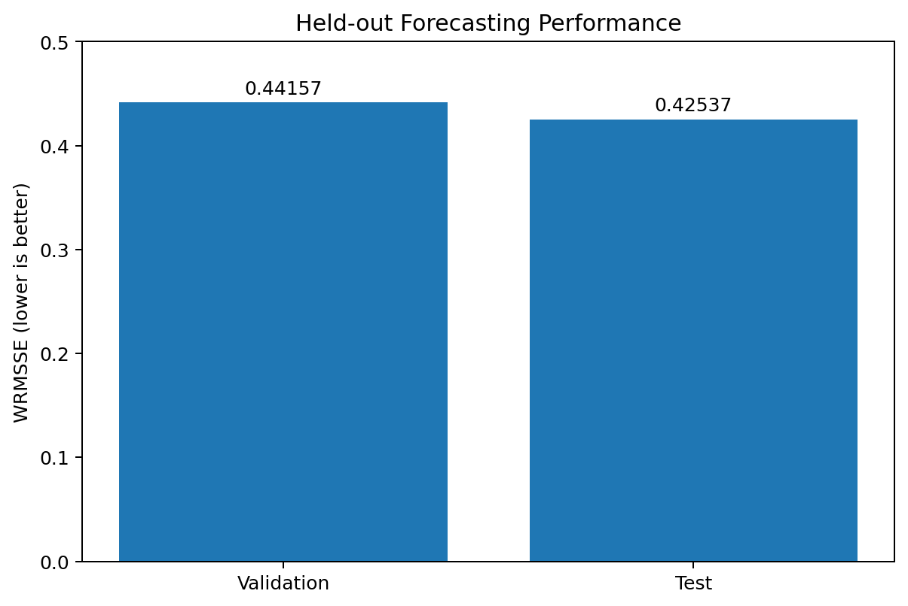
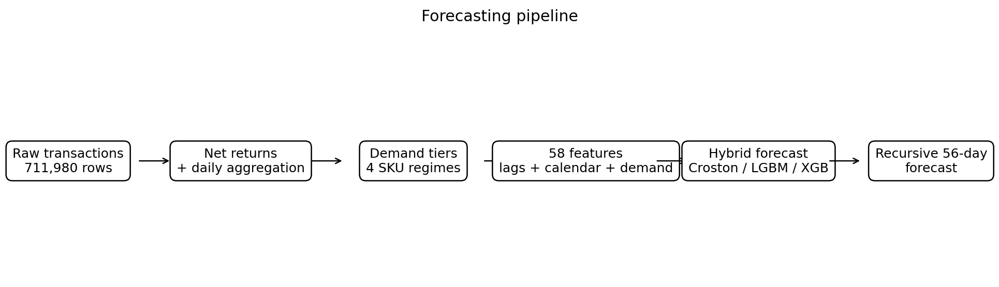
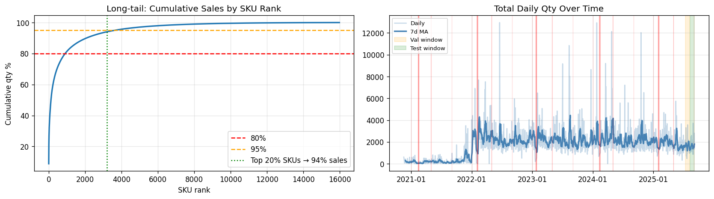
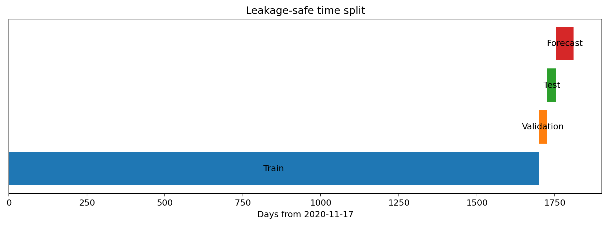
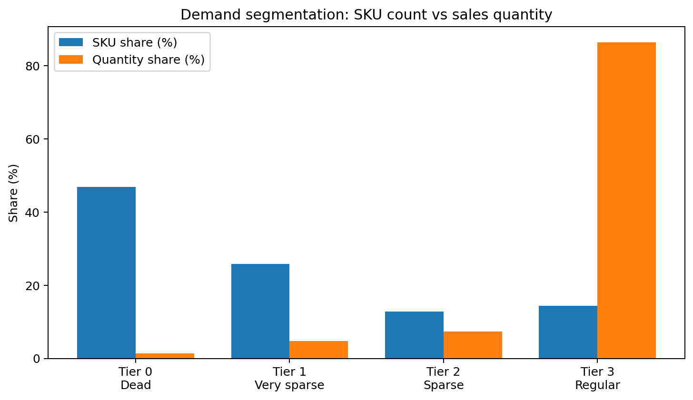
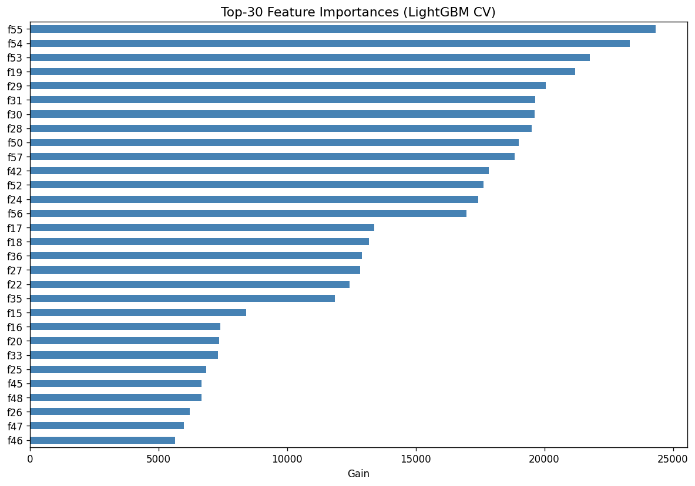
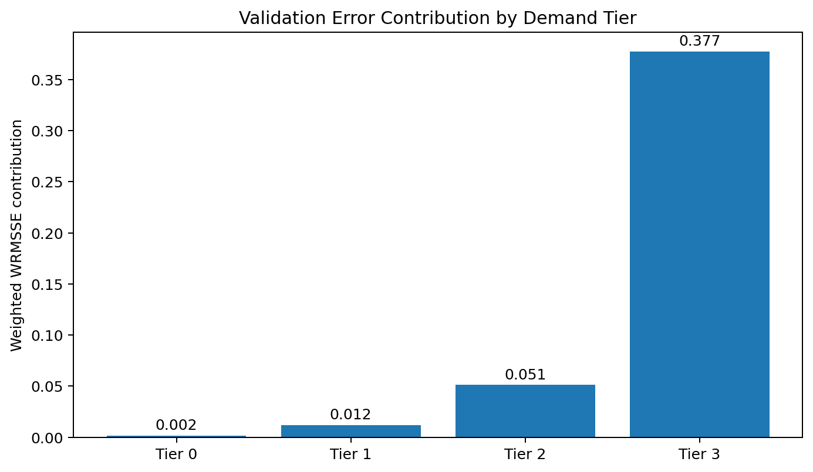
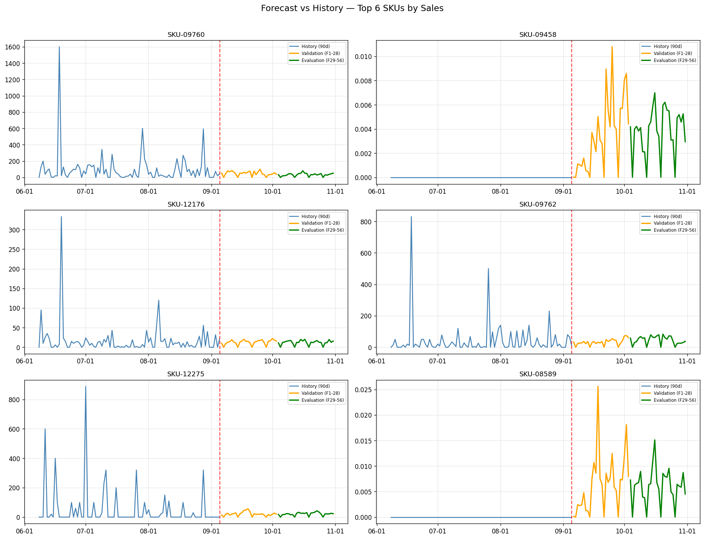

<div align="center">

# HBAAC 2026 — Auto Parts Demand Forecasting

**A hybrid 56-day demand forecasting pipeline for 15,972 automotive-parts SKUs.**

<p>


</p>

</div>

---

## Overview

This project tackles the HBAAC 2026 sales-forecasting task: predict daily demand for **15,972 automotive-parts SKUs** over a **56-day horizon**.

The training data spans **2020-11-17 to 2025-09-05** and contains **711,980 raw transactions**. Demand is highly heterogeneous: almost half of all SKUs are effectively inactive, while a small regular-demand segment accounts for most sold quantity.

Instead of forcing one forecasting method across every SKU, the solution combines **demand segmentation**, **intermittent-demand forecasting**, and a **LightGBM + XGBoost ensemble**.

### Final held-out results

| Metric | Score |
|---|---:|
| Validation WRMSSE | **0.44157** |
| Test WRMSSE | **0.42537** |
| Forecast horizon | **56 days** |
| SKUs | **15,972** |
| Engineered features | **58** |

<p align="center">

</p>

---

## Pipeline

<p align="center">

</p>

The workflow has six major stages:

**Transactions → return-aware daily demand → demand segmentation → feature engineering → specialized forecasting → recursive 56-day forecast**

Returns are netted at SKU-day level before target construction. Chronological validation is used throughout to avoid future leakage.

---

## Data Overview

| Statistic | Value |
|---|---:|
| Raw transactions | **711,980** |
| Daily SKU-date rows | **507,050** |
| Unique SKUs | **15,972** |
| Negative-quantity transactions | **37,434** |
| Negative net SKU-days clipped to zero | **20,733** |
| Historical period | **2020-11-17 → 2025-09-05** |

<p align="center">

</p>

---

## Leakage-Safe Validation

<p align="center">

</p>

| Split | Period |
|---|---|
| Training | through **2025-07-11** |
| Validation | **2025-07-12 → 2025-08-08** |
| Test | **2025-08-09 → 2025-09-05** |
| Final forecast | **2025-09-06 → 2025-10-31** |

The validation and test windows each contain 28 days, matching the two-part competition submission structure.

---

## Demand Segmentation

Demand sparsity is the defining characteristic of this dataset.

| Tier | Demand regime | SKUs | SKU share | Quantity share | Strategy |
|---|---|---:|---:|---:|---|
| Tier 0 | Dead / near-dead | 7,492 | 46.9% | 1.4% | Zero forecast |
| Tier 1 | Very sparse | 4,126 | 25.8% | 4.8% | Recent-demand baseline |
| Tier 2 | Intermittent | 2,050 | 12.8% | 7.4% | Croston + seasonal information |
| Tier 3 | Regular | 2,304 | 14.4% | **86.4%** | LightGBM + XGBoost |

<p align="center">

</p>

### Core insight

Only **14.4% of SKUs generate 86.4% of total quantity**.

That concentration motivates the hybrid architecture: lightweight methods handle low-impact sparse SKUs, while the most expressive models are reserved for the high-volume regular-demand segment.

---

## Feature Engineering

The regular-demand model uses **58 features per SKU-day**, including:

- demand lags and rolling statistics;
- recent-vs-long-term demand behavior;
- zero-demand rate and SKU activity descriptors;
- calendar and cyclical time features;
- Vietnamese holiday and near-holiday indicators;
- return-related information;
- SKU demand statistics.

The pipeline builds these features recursively so that future predictions depend only on information available at each forecast step.

---

## Hybrid Forecasting

### Sparse demand

Dead and very sparse SKUs are deliberately handled with conservative forecasts. Tier 2 uses a Croston-style approach designed for intermittent demand with long zero-demand intervals.

### Regular demand

Tier 3 uses an ensemble of:

**LightGBM + XGBoost**

LightGBM is trained with a **Tweedie objective**, which is appropriate for non-negative, zero-heavy demand. XGBoost adds model diversity before predictions are blended.

<p align="center">

</p>

---

## Error Analysis

<p align="center">

</p>

| Tier | Avg. RMSSE | Weighted contribution |
|---|---:|---:|
| Tier 0 | 0.338 | 0.00165 |
| Tier 1 | 0.551 | 0.01161 |
| Tier 2 | 0.826 | 0.05106 |
| Tier 3 | **0.488** | **0.37725** |

Tier 2 is the hardest segment on an unweighted per-SKU basis, but Tier 3 dominates the weighted competition error because it represents most sales volume.

This gives a clear optimization priority: **improving Tier 3 has the largest expected effect on total WRMSSE**.

---

## Final 56-Day Forecast

The final models are retrained using the available historical data and then rolled forward recursively for the full competition horizon.

<p align="center">

</p>

### Submission sanity checks

| Property | Result |
|---|---:|
| Submission rows | **31,944** |
| Submission columns | **29** |
| SKUs | **15,972** |
| Validation rows | **15,972** |
| Evaluation rows | **15,972** |
| SKUs with ≥1 non-zero 56-day forecast | **4,617** |
| Rows with ≥1 non-zero forecast | **9,234** |
| Sanity checks | **Passed** |

The generated competition file is available at `output/submission_v3.csv`.

---

## Why the Approach Works

The main design choice is to model **demand regimes**, not just rows.

A global forecasting model can easily overpredict dead items and under-handle intermittent ones. Segmenting SKUs first allows each demand pattern to receive an appropriate forecasting strategy.

The final system combines:

- return-aware target construction;
- chronological validation;
- demand-regime specialization;
- Croston forecasting for intermittent demand;
- gradient boosting for regular demand;
- local holiday information;
- recursive multi-step forecasting;
- zero-inflation post-processing.

---

## Repository Structure

```text
HBAAC-2026/
├── README.md
├── requirements.txt
├── run.log
├── src/
│   └── run_pipeline.py
├── figures/
│   ├── eda_overview.png
│   ├── pipeline.png
│   ├── time_split.png
│   ├── demand_tiers.png
│   ├── feat_importance.png
│   ├── wrmsse_performance.png
│   ├── tier_error_contribution.png
│   └── top_sku_forecasts.png
└── output/
    └── submission_v3.csv
```

The competition training dataset is intentionally not bundled into the repository package because of its size.

---

## Reproducing the Pipeline

Install the dependencies from `requirements.txt`, place the competition training file under `data/train.csv`, and execute the forecasting pipeline in `src/run_pipeline.py`.

The included `run.log` contains the complete output from the verified end-to-end run used for the metrics and figures in this README.

---

## Next Steps

The error decomposition suggests several promising extensions:

- tune the Tier 3 ensemble using rolling-origin validation;
- optimize ensemble weights rather than using a fixed blend;
- compare Croston variants for Tier 2;
- introduce category/hierarchical features if product metadata becomes available;
- add probabilistic forecasts and uncertainty intervals;
- model promotions and additional event effects;
- cluster regular-demand SKUs before fitting specialized models.

---

<div align="center">

**HBAAC 2026**

Demand Forecasting · Intermittent Demand · Gradient Boosting

</div>
